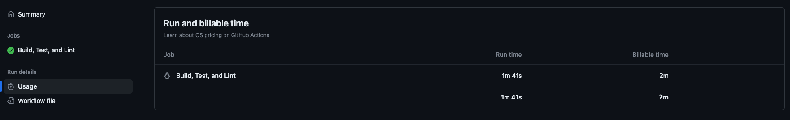
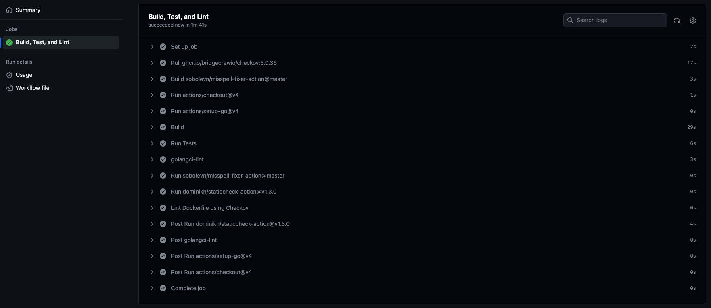

# Simple go app

This is a simple Go application that servers the `/login` and `/secret` endpoints and exposes Prometheus metrics at the `/metrics` endpoint.

## Prerequisites

- Go 1.20 or later
- Docker (If you want to run the application in a Docker container)

## Running the Tests

To run the tests, use the following command:

```zsh
go test
```

This will run all tests in the current package.

## Building the application

To build the application, naviagte to the directory containing the main.go file and run the following command:

```zsh
go build -o app
```

This will create an executable file named `app`.

## Running the application

To run the application ensure the `APP_SECRET` environment variable is set and use the following command:

```zsh
./app
```

This will start the application and it will begin listening on port 8080.

You can then access the `/login` and `/secret` endpoints at `http://localhost:8080/login` and `http://localhost:8080/secret`, respectively.

The Prometheus metrics are available at `http://localhost:8080/metrics`.

## Running the Application with Docker

To run the application with Docker, you first need to build a Docker image. A Dockerfile is included in the repository for this purpose.

To build the Docker image, run the following command:

```zsh
docker build -t app .
```

This will create a Docker image named `app`.

To run the application in a Docker container, use the following command:

```zsh
docker run -p 8080:8080 -e APP_SECRET=test app
```

This will start a Docker container and map port 8080 in the container to port 8080 on your machine. The application inside the container will begin listening on port 8080.

As before, you can access the `/login` and `/secret` endpoints at `http://localhost:8080/login` and `http://localhost:8080/secret`, respectively, and the Prometheus metrics at `http://localhost:8080/metrics`.

## Workflow

This workflow does the following:

- Checks out the repository to the runner.
- ets up a Go environment with the specified Go version.
- Builds the Go application.
- Runs tests in your Go application.
- Lints the Go code using golangci-lint.
- Checks for misspelled words in  code.
- Runs static analysis on Go code using Staticcheck.
- Lints the Dockerfile using Checkov.

Each of these steps is run in order, and if any step fails (i.e., exits with a non-zero status), the workflow is stopped and marked as failed.





## Workflow Improvements

- Docker Build and Push: Add a step in the workflow to build a Docker image of the application and push it to a Docker registry.
- Conditional Jobs: You can use the if keyword to make certain jobs or steps conditional.
- Semantic Versioning: Use Git tags to version the application.
